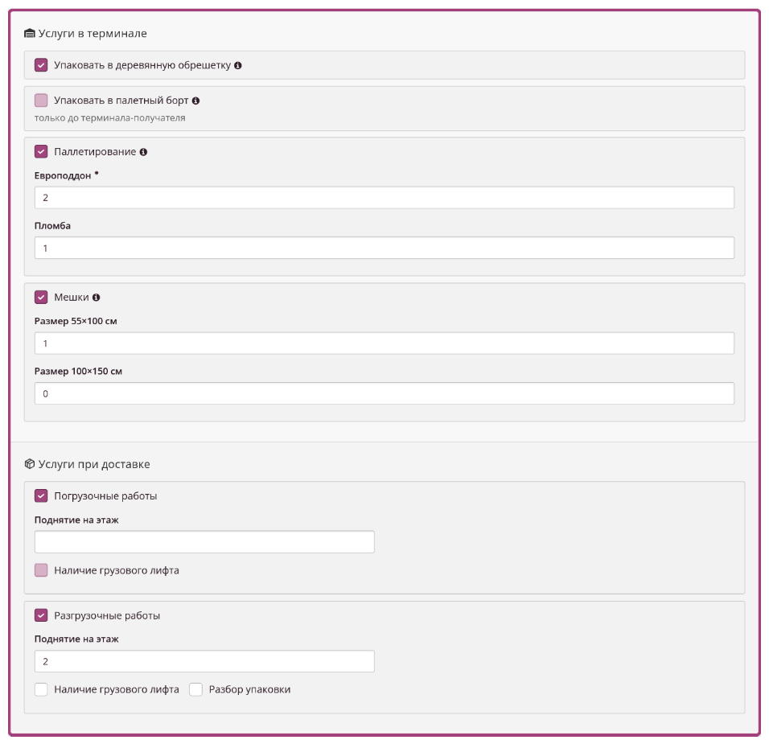

# new note
Подробнее об услугах в приложенной документации, пункт  4.6 Услуги 

| Блок | Услуга | Тултип | Примечание к опци | Описание в API |
| --- | --- | --- | --- | --- |
| У   с   л   у   г   и         в       т   ермин   а   л   е | Упаковка в деревянную обрешётку | Изготовление жесткой упаковки индивидуально по размеру груза. | Опция не совместима с опцией "Упаковать в палетный борт", если уже выбрана упаковка в палетный борт, то упаковка в обрешётку    должна быть задизейблена. |     |
| Упаковать в палетный борт | Ограничение по параметрам груза 1.15x0.75x1.6м и 600кг. | Опция не совместима с опцией "Упаковка в деревянную обрешётку", если уже выбрана упаковка в обрешётку, то упаковка в палетный борт    должна быть задизейблена.       У опции есть ограничения,  нужно проверять указанные пользователем габариты и вес, при превышении ограничения дизеблить выбор опции. Для проверки брать наибольшие габариты из всех указанных мест.    Макс. длина — 1,15м   Макс. щирина — 0,75 м   Макс. высота  — 1,6 м   Макс. общий физ. вес — 600 кг. | {          "guid": "",          "serviceId": 2797,          "serviceName": "Паллетный борт",          "description": "деревянный короб регулируемой высоты – не передается получателю. Ограничение по параметрам груза 1.15x0.75x1.35м и 600кг",          "sections": \[              "cargo"          \],          "relatedServices": \[\],          "prohibitionOfCombination": \[              "3228"          \],          "classifier": {              "id": 2,              "name": "Упаковка"          }      } |
| Палетирование | Укладка груза на европоддон с закреплением скотчем и стрейч-пленкой.    Определение веса и объема груза производится после его укладки на поддон | При выборе опции должны появляться 2 поля ввода "Европоддон" и "Пломба", по умолчанию значение в полях 0. | {          "guid": "",          "serviceId": 19,          "serviceName": "Паллетирование",          "description": "укладка груза на европоддон с закреплением скотчем и стрейч-пленкой",          "sections": \[              "cargo"          \],          "relatedServices": \[\],          "prohibitionOfCombination": \[\],          "classifier": {              "id": 2,              "name": "Упаковка"          },          "group": {              "id": 2,              "name": "Паллетирование"          },          "fields": \[              {                  "id": 19,                  "type": "bool",                  "default": false              }          \]      }      {          "guid": "",          "serviceId": 2770,          "serviceName": "Европоддон",          "description": "",          "sections": \[              "cargo"          \],          "relatedServices": \[\],          "prohibitionOfCombination": \[\],          "classifier": {              "id": 2,              "name": "Упаковка"          },          "group": {              "id": 2,              "name": "Паллетирование"          },          "fields": \[              {                  "id": 2770,                  "type": "number",                  "default": 0              }          \]      } |
| Упаковка в мешки | Полипропиленовый мешок под пломбу используется для упаковки небольших, ценных грузов, партий мелких грузов.    Пломба включена в стоимость упаковки и служит гарантией защиты груза от несанкционированного доступа. | При выборе опции должны появляться 2 поля ввода "Размер 55×100 см" и "Размер 100×150 см", по умолчанию значение в полях 0. |     |
| У  с  л  у  г  и  при д  о  с  т  в  к  е | Погрузочные работы |     | При выборе опции должны появляться чекбокс "Наличие грузового лифа" и поле ввода "Поднятие на этаж",    поле по умолчанию пустое минимально допустимое значение 0. | {          "guid": "",          "serviceId": 13,          "serviceName": "ПРР в городе отправления",          "description": "",          "sections": \[              "departure"          \],          "relatedServices": \[\],          "prohibitionOfCombination": \[\],          "classifier": {              "id": 3,              "name": "Забор"          }      } |
| Разгрузочные работы |     | При выборе опции должны появляться чекбокс "Наличие грузового лифа", чекбокс "Разбор упаковки" и поле ввода "Поднятие на этаж", поле по умолчанию пустое, минимально допустимое значение 1. | {          "guid": "",          "serviceId": 14,          "serviceName": "ПРР в городе назначения",          "description": "",          "sections": \[              "destination"          \],          "relatedServices": \[\],          "prohibitionOfCombination": \[\],          "classifier": {              "id": 4,              "name": "Доставка"          }      } |
| Бдлок доп услуг | Возврат сопроводительных документов |     |     | {          "guid": "",          "serviceId": 16,          "serviceName": "Возврат документов",          "description": "",          "sections": \[              "cargo"          \],          "relatedServices": \[\],          "prohibitionOfCombination": \[\],          "classifier": {              "id": 5,              "name": "Прочие услуги"          }      } |

Блок доп опций 

В блок "Услуги в терминале"  нужно добавить опции:  
1) "Упаковка в деревянную обрешётку" и тултип к опции с текстом "Изготовление жесткой упаковки индивидуально по размеру груза."  
Опция не совместима с опцией "Упаковать в палетный борт", если уже выбрана упаковка в палетный борт, то упаковка в обрешётку   
должна быть задизейблена.

2) "Упаковать в палетный борт" и тултип к опции с текстом "Ограничение по параметрам груза 1.15x0.75x1.6м и 600кг. "  
Опция не совместима с опцией "Упаковка в деревянную обрешётку", если уже выбрана упаковка в обрешётку, то упаковка в палетный борт   
должна быть задизейблена.   
У опции есть ограничения веса и габаритов,  если найбольшие параметры указанныз  
длина>1.15 м /ширина >0,75 м/высота >1.6 м / общий вес > 600 кг, тогда опция должна быть задизейблена.

3) "Палетирование" и тултип опции с текстом "Укладка груза на европоддон с закреплением скотчем и стрейч-пленкой.   
Определение веса и объема груза производится после его укладки на поддон."  
При выборе опции должны появляться 2 поля ввода "Европоддон" и "Пломба", по умолчанию значение в полях 0.

4) "Упаковка в мешки" и тултип опции с текстом "Полипропиленовый мешок под пломбу используется для упаковки небольших, ценных грузов, партий мелких грузов.   
Пломба включена в стоимость упаковки и служит гарантией защиты груза от несанкционированного доступа."  
При выборе опции должны появляться 2 поля ввода "Размер 55×100 см" и "Размер 100×150 см", по умолчанию значение в полях 0.

  
В блок "Услуги при доставке"  нужно добавить опции:  
1) "Погрузочные работы"  
При выборе опции должны появляться чекбокс "Наличие грузового лифа" и поле ввода "Поднятие на этаж",   
поле по умолчанию пустое минимально допустимое значение 0.

  
2) "Разгрузочные работы"  
При выборе опции должны появляться чекбокс "Наличие грузового лифа", чекбокс "Разбор упаковки" и поле ввода "Поднятие на этаж",   
поле по умолчанию пустое минимально допустимое значение 0.